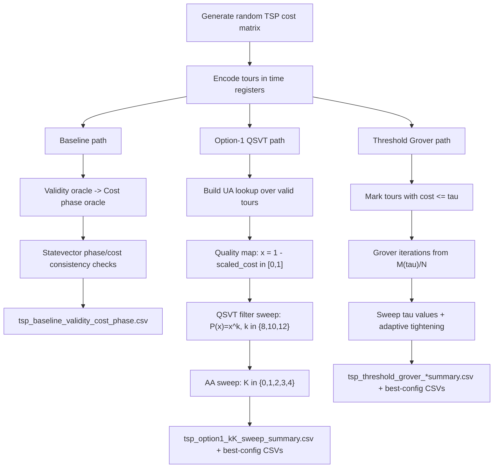

# TSP Quantum Circuit Experiments (PennyLane)

This repository is a small simulation sandbox for exploring quantum-inspired workflows on a Traveling Salesman Problem (TSP) instance.

It currently includes:
- a baseline phase-encoding pipeline,
- an option-1 QSVT pipeline using a nonnegative quality map and monotonic filter,
- a thresholded Grover pipeline (`cost_norm <= tau` marking).

All experiments are currently set up for small `n` (default `n=5`) and are meant for simulator study, not scalable production solving.

## What The Repo Contains

- `src/classical_funcs.py`
  - Classical helpers to generate a random cost matrix, enumerate tours, compute costs, and pick the best classical tour.
- `base_code_doing_stat_praparation_no_amp.py`
  - Baseline:
    - uniform superposition over encoded walks,
    - validity oracle (`good` flag),
    - full cost phase oracle,
    - statevector analysis and CSV output.
- `qsvt_option1_monotonic.py`
  - Option-1 implementation:
    - maps tour quality to `x = 1 - scaled_cost` in `[0,1]`,
    - sweeps monotonic `P(x)=x^k` filters for `k in [8,10,12]`,
    - sweeps AA iterations `K in [0,1,2,3,4]`,
    - runs AA on success `(good=1 AND sig=0)`,
    - writes combined sweep summaries and best-configuration outputs.
- `tsp_threshold_grover.py`
  - Threshold-Grover implementation:
    - marks tours with `cost_norm <= tau` via exact lookup oracle,
    - runs Grover on time-register states,
    - sweeps multiple threshold values,
    - runs an adaptive threshold-tightening loop from sampled costs,
    - writes per-threshold outputs plus grid/adaptive summaries.

## High-Level Flow



## Setup

### 1. Create and activate a virtual environment

```bash
python3 -m venv .venv
source .venv/bin/activate
```

### 2. Install dependencies

```bash
pip install -r requirements.txt
```

## Run Experiments

From the repository root:

### Baseline (no amplification, no QSVT)

```bash
python3 base_code_doing_stat_praparation_no_amp.py
```

Output:
- `tsp_baseline_validity_cost_phase.csv`

### Option-1 QSVT (nonnegative quality + monotonic filter)

```bash
python3 qsvt_option1_monotonic.py
```

Output:
- `tsp_option1_kK_sweep_summary.csv` (all `(k, K)` configs)
- `tsp_option1_k_sweep_summary.csv`
- `tsp_option1_best_k<k>_K<K>_samples.csv`
- `tsp_option1_best_k<k>_K<K>_ranking.csv`
- Backward-compatible aliases:
  - `tsp_option1_monotonic_samples.csv`
  - `tsp_option1_monotonic_ranking.csv`

### Threshold Grover (cost threshold oracle)

```bash
python3 tsp_threshold_grover.py
```

Output:
- `tsp_threshold_tauXX_samples.csv` and `tsp_threshold_tauXX_ranking.csv` (per threshold)
- `tsp_threshold_grover_sweep_summary.csv`
- `tsp_threshold_grover_adaptive_summary.csv`
- `tsp_threshold_grover_all_runs_summary.csv`
- `tsp_threshold_grover_best_samples.csv`
- `tsp_threshold_grover_best_ranking.csv`

## Notes

- These scripts use `lightning.qubit` (`pennylane-lightning` plugin).
- Most scripts normalize costs into phase-friendly ranges before encoding.
- The current implementation uses explicit loops over valid tours in QSVT scripts, which is intentional for small simulator experiments and is not scalable.
- CSV artifacts are ignored by git (`/*.csv` in `.gitignore`).
